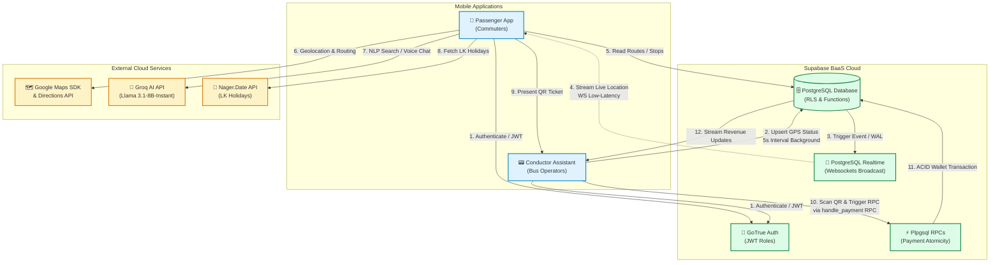
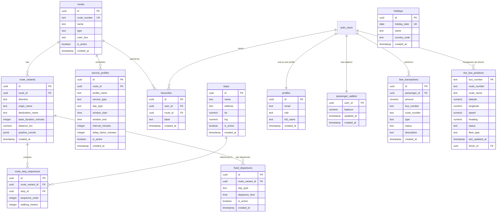

# 🚌 TransLink – Unified Transit Ecosystem (V4.0)

[](https://github.com/PandaSL2/TransLink)
[](https://flutter.dev)
[](https://supabase.com)
[](https://groq.com)
[]()

TransLink is a state-of-the-art, location-aware public transport and digital wallet ecosystem designed for the Sri Lankan transportation sector. By deeply integrating **Google Maps SDK**, **Supabase Realtime Websockets**, and **Llama 3.1 LLM (via Groq)**, TransLink bridges the gap between commuters and transit operators—eliminating the need for expensive manual dispatch dashboards and providing a seamless, automated, and localized digital ticketing experience.

---

## 🗺️ System Architecture

The TransLink ecosystem consists of two distinct cross-platform mobile clients communicating via an ACID-compliant, real-time backend-as-a-service (BaaS) and external microservices.



---

## 🗄️ Database Entity Relationship Diagram (ERD)

The PostgreSQL database is highly structured with primary-foreign key integrity constraints, PostgreSQL functions, and row-level security (RLS) policies guarding sensitive data.



---

## ✨ Core Features & Technical Implementation

### 🔴🔵 1. Real-time Mixed Fleet Synchronization
- **Dynamic Live Tracking**: Tracks both Private and CTB (State) buses simultaneously. CTB buses render dynamically as **Red** markers, while Private buses appear as **Blue** markers.
- **WebSocket Broadcast**: Uses Supabase Realtime to push live bus locations at a **5-second interval** directly to the Google Maps UI in the passenger app with zero-flicker updating.
- **Operating Hours Intelligence**: The Conductor app actively checks schedule profiles (`RouteScheduleService`) and automatically terminates tracking when operating hours end.

### 💳 2. Smart Wallets & Secure QR Payments
- **Secure Ticketing**: Passengers generate a secure QR code encoding their `uid`, requested journey `fare`, and destination (`dest`).
- **Atomic Transactions (Postgres RPC)**: Payments are processed on the server via the custom PostgreSQL function `handle_payment`. This ensures database **atomicity**: the passenger's wallet is decremented and a transaction record is created within a single transaction block. If any step fails (e.g., insufficient funds), the entire block rolls back to prevent inconsistencies.
- **Live Revenue Streaming**: The Conductor's homepage listens to a live stream of `fare_transactions` filtered by their specific `bus_number`, instantly updating their **Session Revenue** and **Passenger Count** widgets upon a successful scan.

### 🗣️ 3. Intelligent AI Transit Chatbot
- **Llama-3.1 Processing (Groq)**: Integrated directly in the passenger app is an interactive AI chatbot using the ultra-fast `llama-3.1-8b-instant` model.
- **Context-Aware Assistance**: The chatbot receives live database structures (available routes and stops) dynamically in its system prompt to answer specific routing, timetable, and fare queries accurately.
- **Smart suggestions**: Auto-suggests stops (`getSuggestions`) and interprets speech/natural language queries (`interpretQuery`) dynamically.
- **Tri-lingual Responses**: Dynamically updates prompt instructions so the AI responds exclusively in the user's selected language (Sinhala, Tamil, or English).

### 🌍 4. Complete Tri-lingual Localization
- **Native Inline Localization**: Fully translated interface supporting **English**, **Sinhala (සිංහල)**, and **Tamil (தமிழ்)** across all text elements, dialogs, error handlers, and notifications.
- **Localized Voice Feedback**: App actions speak/respond utilizing appropriate regional language contexts for voice search capabilities.

---

## 📂 Project Directory Structure

```text
TransLink/
├── supabase/                            # Supabase Backend Configuration
│   ├── functions/                       # Edge Functions
│   └── migrations/                      # Database Schema & Data Migrations
│       ├── supabase_schema.sql          # Primary Tables, Triggers, & Indexes
│       ├── 010_seed_real_routes.sql     # Seed script for Sri Lankan Bus Routes
│       ├── 012_payment_rpc.sql          # Secure transactional payments RPC
│       └── 013_drop_unused_tables.sql   # Unused table cleanup
├── translink_passenger/                 # Commuter Mobile Application (Flutter)
│   ├── assets/                          # App Icons, Images & Fonts
│   └── lib/
│       ├── core/
│       │   ├── constants/               # Credentials & Config (app_constants.dart)
│       │   └── utils/                   # Translation Engines (app_localizations.dart)
│       ├── features/                    # UI Modules (Map, Wallet, AI Support, etc.)
│       └── services/                    # APIs & Services (supabase_service.dart, ai_service.dart)
├── translink_Conductor/                 # Driver/Conductor Mobile Application (Flutter)
│   └── lib/
│       ├── core/
│       │   └── constants/               # Credentials & Config (driver_constants.dart)
│       ├── features/                    # Core Modules (Home setup, QR Scanner dashboard)
│       └── services/                    # GPS Background tracking, RPC Scan payments
└── releases/                            # Pre-compiled Android Artifacts
    ├── translink_passenger_v4.apk       # Finished Commuter APK
    └── translink_conductor_v4.apk       # Finished Driver APK
```

---

## ⚙️ Environment Configuration & Setup

### 🔑 1. Setting up Credentials
To connect the ecosystem to your custom database and services, modify the environment files in the respective directories:

#### Commuter App (Passenger)
Open [app_constants.dart](file:///d:/Projects/Translink/TransLink/translink_passenger/lib/core/constants/app_constants.dart) and configure the following:
```dart
class AppConstants {
  static const String supabaseUrl = 'YOUR_SUPABASE_URL';
  static const String supabaseAnonKey = 'YOUR_SUPABASE_ANON_KEY';
  static const String googleMapsApiKey = 'YOUR_GOOGLE_MAPS_API_KEY';
}
```

#### Driver App (Conductor)
Open [driver_constants.dart](file:///d:/Projects/Translink/TransLink/translink_Conductor/lib/core/constants/driver_constants.dart) and configure the following:
```dart
class DriverConstants {
  static const String supabaseUrl = 'YOUR_SUPABASE_URL';
  static const String supabaseAnonKey = 'YOUR_SUPABASE_ANON_KEY';
  static const String groqApiKey = 'YOUR_GROQ_API_KEY';
}
```

### 💻 2. Building and Running Locally

Ensure you have Flutter SDK (>=3.0.0) installed and configured.

#### Step 1: Clone and navigate to workspace
```bash
git clone https://github.com/PandaSL2/TransLink.git
cd TransLink
```

#### Step 2: Set up Passenger App
```bash
cd translink_passenger
flutter pub get
flutter run
```

#### Step 3: Set up Conductor App
```bash
cd ../translink_Conductor
flutter pub get
flutter run
```


